# Variance indicator style catalog

<!-- Generated by scripts/build_styles.py. Edit the script, not this file. -->

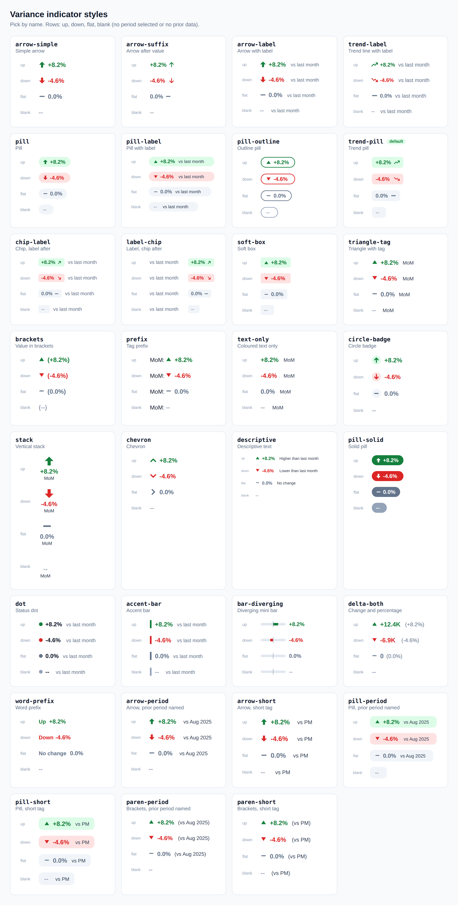

Default style: **`trend-pill`**, used when no style is named.

Pick a style by name. Each preview shows the four states: up (+8.2%), down (-4.6%),
flat (0.0%) and blank (`--`, when no period is selected or the prior period has no data).
Colours flip for metrics where lower is better (`_HigherIsBetter = FALSE ()`).

Labels come in three kinds:

- **Generic** (`vs last month`, `MoM`): most styles. Set `_Label` to `""` to hide it, or to
  `QoQ` / `vs last quarter` / `YoY` / `vs last year` for the other periods.
- **Prior period named** (`*-period` styles): `vs Aug 2025`, computed from the selected
  period by `[MoM Prior Label]`, `[QoQ Prior Label]` or `[YoY Prior Label]`
  ([period-measures.md](period-measures.md)). Never typed in by hand.
- **Short tag** (`*-short` styles): `vs PM`, `vs PQ` or `vs PY`.

| Style | Looks like | Notes | Measure |
|---|---|---|---|
| **`arrow-simple`** Simple arrow | 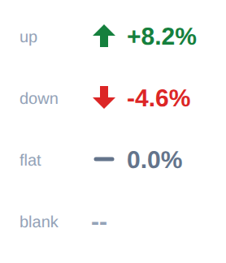 | Bold block arrow and the percentage, nothing else. From: Style sheet #1 | [arrow-simple.dax](styles/arrow-simple.dax) |
| **`arrow-suffix`** Arrow after value | 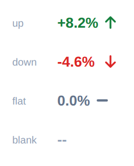 | Percentage first, thin arrow after it. Quiet, fits next to a big KPI number. From: Examples: 12.9% ↓, 80.9% ↑ | [arrow-suffix.dax](styles/arrow-suffix.dax) |
| **`arrow-label`** Arrow with label | 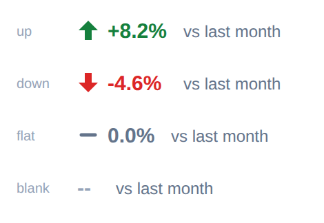 | Block arrow, percentage, then a grey comparison label. From: Style sheet #3 (and #2 without the month) | [arrow-label.dax](styles/arrow-label.dax) |
| **`trend-label`** Trend line with label | 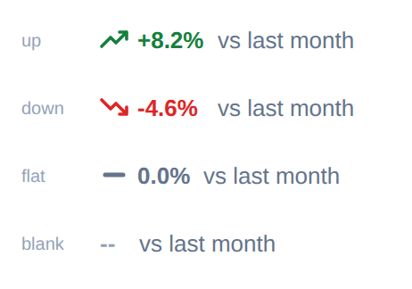 | Small trend-line icon, coloured percentage, grey label. From: Examples: ↗ 5% vs last month, ↗ 12.00% from June | [trend-label.dax](styles/trend-label.dax) |
| **`pill`** Pill | 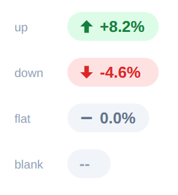 | Soft coloured pill with arrow and percentage. From: Style sheet #4 | [pill.dax](styles/pill.dax) |
| **`pill-label`** Pill with label | 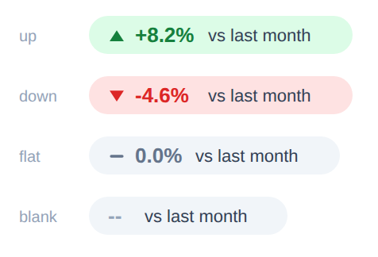 | Soft pill holding the arrow, percentage and a short label. From: Style sheet #6 (and #5 without the month) | [pill-label.dax](styles/pill-label.dax) |
| **`pill-outline`** Outline pill | 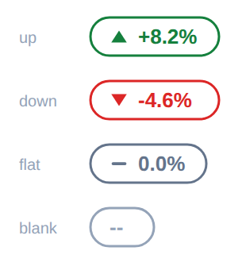 | White pill with a coloured border, triangle and percentage. From: Style sheet #7 | [pill-outline.dax](styles/pill-outline.dax) |
| **`trend-pill`** (default) Trend pill | 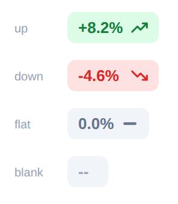 | Percentage then a trend-line icon, inside a soft rounded box. From: Examples: 12.20% ↗, 38.64% ↗, 32.73% ↘ | [trend-pill.dax](styles/trend-pill.dax) |
| **`chip-label`** Chip, label after | 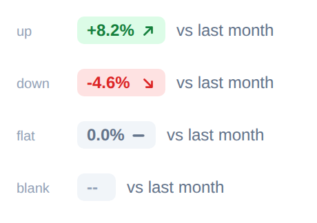 | Small chip with percentage and diagonal arrow, grey label after it. From: Examples: +3.2% ↑ from last month, ↗ +6.2% vs last month | [chip-label.dax](styles/chip-label.dax) |
| **`label-chip`** Label, chip after | 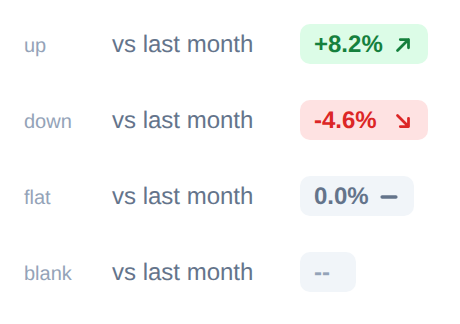 | Grey label first, then the small chip. Good in a row of KPI cards. From: Example: vs Last Week +1.3% ↗ | [label-chip.dax](styles/label-chip.dax) |
| **`soft-box`** Soft box | 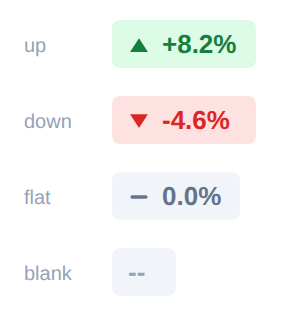 | Square-cornered soft box with triangle and percentage; add a tag such as MoM if you like. From: Example: ▲ 12.4%; reference sheet #13 with a tag | [soft-box.dax](styles/soft-box.dax) |
| **`triangle-tag`** Triangle with tag | 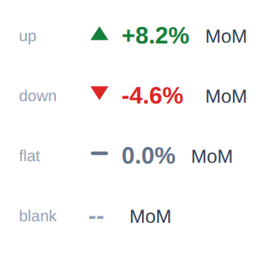 | Triangle, bold percentage and a short period tag (MoM, QoQ, YoY). From: Style sheet #8 and #9 | [triangle-tag.dax](styles/triangle-tag.dax) |
| **`brackets`** Value in brackets | 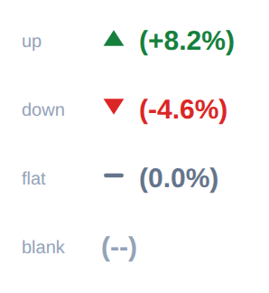 | Triangle and the percentage in brackets. From: Style sheet #10 | [brackets.dax](styles/brackets.dax) |
| **`prefix`** Tag prefix | 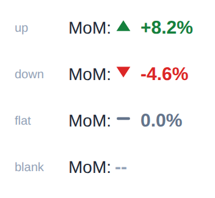 | Period tag first (MoM:), then triangle and percentage. From: Style sheet #11 | [prefix.dax](styles/prefix.dax) |
| **`text-only`** Coloured text only | 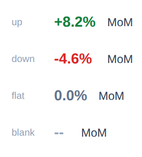 | No icon: coloured percentage and a period tag. From: Style sheet #14 and #19 | [text-only.dax](styles/text-only.dax) |
| **`circle-badge`** Circle badge | 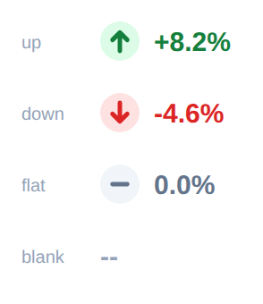 | Arrow inside a soft circle, then the percentage. From: Style sheet #15 | [circle-badge.dax](styles/circle-badge.dax) |
| **`stack`** Vertical stack | 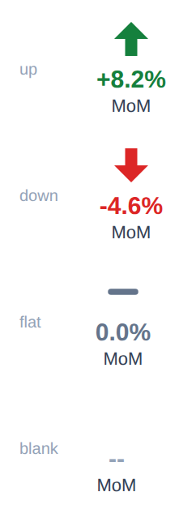 | Big arrow on top, percentage under it, tag at the bottom. Made for narrow tiles. From: Style sheet #16 | [stack.dax](styles/stack.dax) |
| **`chevron`** Chevron | 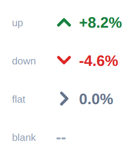 | Thick chevron and the percentage; flat shows a right chevron. From: Style sheet #17 | [chevron.dax](styles/chevron.dax) |
| **`descriptive`** Descriptive text | 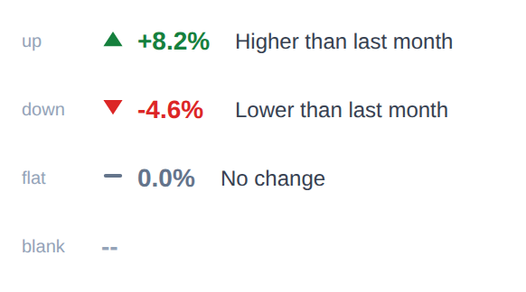 | Triangle, percentage and a plain-language sentence that changes with direction. From: Style sheet #18 | [descriptive.dax](styles/descriptive.dax) |
| **`pill-solid`** Solid pill | 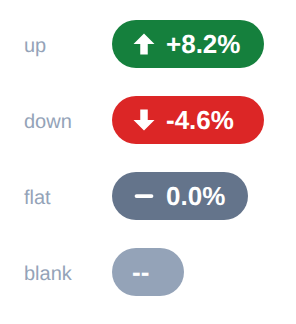 | Solid status-colour pill with white arrow and text. Highest contrast; good on busy cards. From: Library addition | [pill-solid.dax](styles/pill-solid.dax) |
| **`dot`** Status dot | 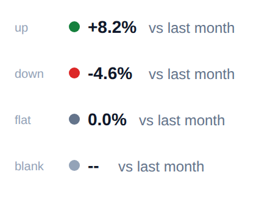 | Coloured dot, dark percentage and a grey label. Lets the number stay neutral. From: Library addition | [dot.dax](styles/dot.dax) |
| **`accent-bar`** Accent bar | 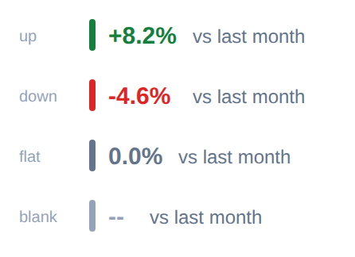 | Thin vertical status bar on the left, coloured percentage and a label. From: Library addition | [accent-bar.dax](styles/accent-bar.dax) |
| **`bar-diverging`** Diverging mini bar | 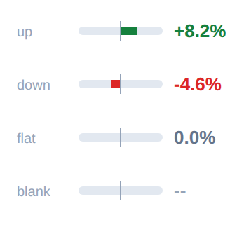 | Tiny bar that grows right for gains and left for losses (full length at +/-20%, set _Cap), then the percentage. Shows size at a glance in a table. From: Library addition | [bar-diverging.dax](styles/bar-diverging.dax) |
| **`delta-both`** Change and percentage | 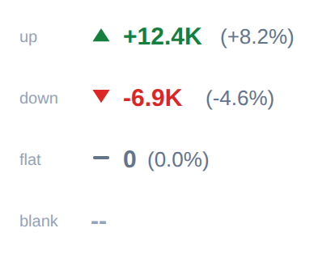 | Triangle, the absolute change (+12.4K) and the percentage in brackets. Needs the change measure from period-measures.md. From: Library addition | [delta-both.dax](styles/delta-both.dax) |
| **`word-prefix`** Word prefix | 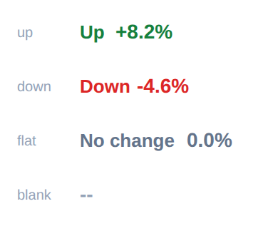 | Up / Down / No change spelled out before the percentage, so the meaning does not rely on colour. From: Library addition (accessibility) | [word-prefix.dax](styles/word-prefix.dax) |
| **`arrow-period`** Arrow, prior period named | 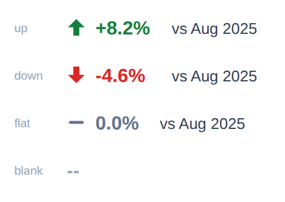 | Block arrow, bold percentage and the actual prior period (vs Aug 2025) in dark grey. From: Example: ⬆ +8.2%  vs Aug 2025 | [arrow-period.dax](styles/arrow-period.dax) |
| **`arrow-short`** Arrow, short tag | 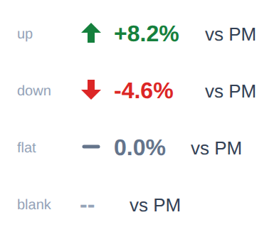 | Block arrow, bold percentage and a short tag (vs PM, vs PQ, vs PY) in dark grey. From: Example: ⬆ +8.2%  vs PM | [arrow-short.dax](styles/arrow-short.dax) |
| **`pill-period`** Pill, prior period named | 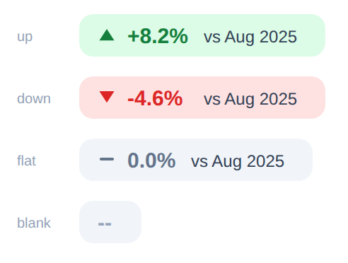 | Soft pill with triangle, bold percentage and the actual prior period (vs Aug 2025). From: Example: pill ▲ +8.2% vs Aug 2025 | [pill-period.dax](styles/pill-period.dax) |
| **`pill-short`** Pill, short tag | 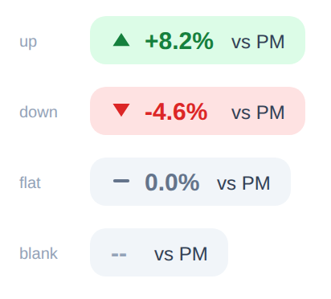 | Soft pill with triangle, bold percentage and a short tag (vs PM, vs PQ, vs PY). From: Example: pill ▲ +8.2% vs PM | [pill-short.dax](styles/pill-short.dax) |
| **`paren-period`** Brackets, prior period named | 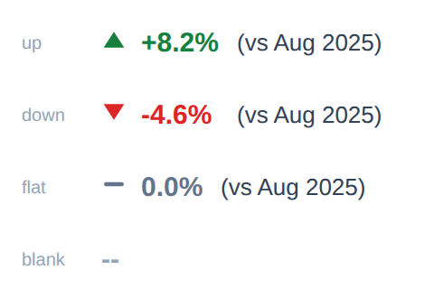 | Triangle, bold percentage and the actual prior period (vs Aug 2025) in brackets. From: Example: ▲ +8.2% (vs Aug 2025) | [paren-period.dax](styles/paren-period.dax) |
| **`paren-short`** Brackets, short tag | 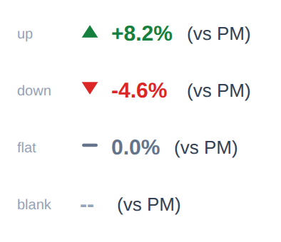 | Triangle, bold percentage and a short tag (vs PM, vs PQ, vs PY) in brackets. From: Example: ▲ +8.2% (vs PM) | [paren-short.dax](styles/paren-short.dax) |
